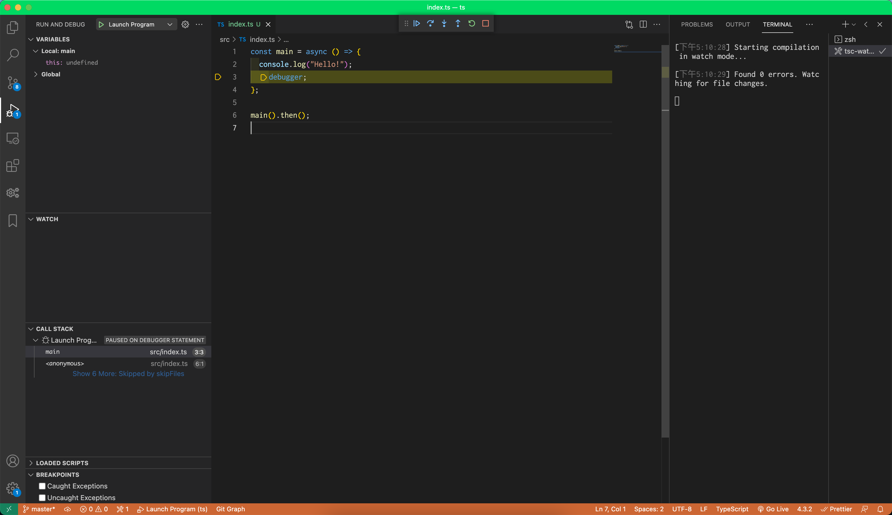

# template-typescript

> A template for typescript project. 
>
> 使用typescript的模版项目。

## 功能

- [x] 普通运行（tsc）
- [x] 直接运行（ts-node）
- [ ] 打包运行（webpack）
- [x] vscode调试配置（F5）

## 使用

```shell
git clone git@github.com:czzonet/template-typescript.git
```

移除原.git文件夹，重新git初始化

```shell
git init
```

## 调试演示



## 构建指南

```shell
git init
yarn init
tsc --init
yarn add -D ts-node typescript
```

